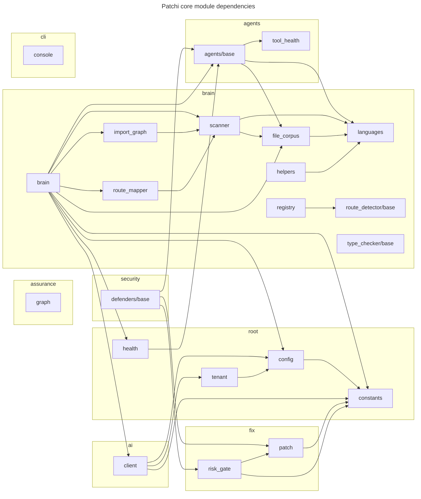

<p align="center">
  
</p>

<h1 align="center">Patchi</h1>

<p align="center">
  <strong>AI-powered code security & quality orchestrator</strong><br>
  CLI agent colony + unified web UI that scans, secures, tests, and fixes your codebase.
</p>

<p align="center">
  <a href="#quick-start">Quick Start</a> ·
  <a href="#features">Features</a> ·
  <a href="#commands">Commands</a> ·
  <a href="#security-agents">Agents</a> ·
  <a href="#ai-setup">AI Setup</a> ·
  <a href="#architecture">Architecture</a> ·
  <a href="docs/WEB.md">Web UI</a> ·
  <a href="docs/CLI.md">CLI Reference</a> ·
  <a href="docs/ARCHITECTURE.md">Architecture</a> ·
  <a href="docs/DEPLOYMENT.md">Deployment</a>
</p>

<p align="center">
  
  
  
  
  
  
</p>

---

## What is Patchi?

Patchi is a **CLI agent colony + unified web UI** that scans, secures, tests, and fixes your codebase using static analysis and optional AI.

**1:1 CLI ↔ Web** — the web is a fancy wrapper; every screen maps to a command. Cross-platform (Windows, Linux, macOS).

### The Loop

```
Scan → Analyze → Fix → Review → Guard
```

1. **Scan** — Parse every file with tree-sitter AST, build import graph, detect secrets
2. **Analyze** — 125 security agents run in parallel, each specializing in one vulnerability class
3. **Fix** — AI generates surgical patches, scored by risk and confidence
4. **Review** — User reviews before applying (or autopilot mode applies automatically)
5. **Guard** — Hosted mode monitors live applications with anomaly detection

---

## Quick Start

```bash
# Install
pip install .
# or with web UI:
pip install ".[web]"

# Initialize and scan
cd your-project
p init              # one-time setup
p scan              # full scan (static analysis, no AI tokens)
p scan --with-license   # include supply-chain license audit
p scan --deep       # with LLM analysis on changed files
p scan --json       # JSON output for CI/CD
p scan --offline    # static analysis only, no AI calls

# Check and fix
p quick             # fast readiness check (3 agents)
p status            # brain health, mode, queue, AI status
p fix               # apply AI-generated fixes
p fix --dry-run     # preview fixes without applying
p fix-review        # interactive review with diff view

# Web UI
p web               # launch at http://127.0.0.1:1612
p web --open        # auto-open browser
```

**Requires Python 3.11+**

---

## Features

### Scanning & Analysis

- **Multi-language AST** — Python, JS, TS, Rust, Go, Java, C, C++, Swift, Ruby, PHP, C#, Kotlin, Dart, SQL, HTML, CSS, Svelte, Bash (20+ via tree-sitter)
- **Git-aware** — incremental scanning via `git diff`, blame integration
- **Import graph** — full dependency visualization, circular detection, orphan files
- **Route mapper** — detects routes across 18 frameworks (Django, Flask, FastAPI, Express, Next.js, etc.)
- **Dead code detection** — unreachable files, broken imports, uncertain code
- **Duplicate detection** — AST-normalized code duplication
- **Secret scanning** — hardcoded credentials, API keys, connection strings

### Security

- **125 security agents** across 11 categories (injection, auth, crypto, secrets, supply chain, config, compliance, privacy, runtime, adversarial, governance)
- **800 security domains** with 2,955 playbooks from OWASP, CWE, NIST, SANS
- **OWASP Top 10 mapping** with CWE-aware correlation
- **Exploit chain detection** — cross-agent correlation finds multi-step attack paths
- **External tool integration** — Semgrep CE, Gitleaks, OSV-Scanner, httpx, CodeQL
- **Domain enrichment** — each finding includes matching domains, playbook references, and fix strategies

### Fixing

- **Risk-gated patches** — every fix scored by risk (0-100) and confidence
- **Atomic rollback** — snapshot before every apply, undo anytime
- **Verify loop** — security fixes re-checked to confirm resolution
- **Interactive review** — `p fix-review` with accept/reject/skip and inline diff
- **Learning brain** — tracks your accept/reject patterns, stops suggesting rejected fix types

### Testing

- **Multi-modal** — unit, browser (Playwright), stress, visual regression, API, E2E
- **Video recording** — DAST sessions captured with Playwright
- **Visual regression** — multi-viewport baselines (desktop/tablet/mobile)
- **Pre-commit hook** — runs gate on every commit

### AI Integration

- **14 providers** — OpenAI, Anthropic, Google, Groq, Mistral, Cohere, Together AI, Fireworks, Perplexity, OpenRouter, DeepSeek, xAI, NVIDIA, Hugging Face + custom OpenAI-compatible
- **4 tiers** (priority order):
  1. Local model via Ollama — fully offline, zero cost
  2. API keys — any OpenAI-compatible provider
  3. Free keys — Groq, Google AI, OpenRouter, Mistral, Together AI
  4. Manual fallback — user-provided keys
- **Cost tracking** — budget alerts, provider rotation
- **Keys stored locally** in `.patchi/keys.json`, never sent elsewhere

### Web UI

- **Dashboard** — health score, AI cost, findings overview
- **Brain Map** — interactive 2D/3D code visualization (Konva.js + Three.js)
- **Findings** — filterable table with severity, type, agent, domain
- **Assurance** — coverage heatmap with treemap view
- **Live Tests** — browser test recordings and visual regression evidence
- **Self-Improvement** — agent profiles, learning summary, threat model evolution
- **Real-time updates** — WebSocket for live scan progress

### CLI UX

- **Spinners** — context-managed status indicators
- **Progress bars** — multi-phase progress with task tracking
- **Formatted tables** — Rich tables for findings, commands, results
- **Summary panels** — key metrics at a glance
- **Interactive prompts** — confirm, select, fix-review
- **Command families** — `p <family> commands` to discover by category

---

## Commands

**60 commands** across **24 families.** Full reference → [docs/CLI.md](docs/CLI.md)

### Command Families

| Family | Purpose |
|--------|---------|
| `scan` | Scanning & analysis (`scan`, `security`, `deps`, `chains`, `findings`, `blast`, `impact`, `why`) |
| `fix` | Fixing & patching (`fix`, `fix-review`, `auto`, `patch`, `undo`, `redo`, `rollback`) |
| `test` | Testing (`test`, `verify`) |
| `agent` | Agent management (`agents`, `agent-stats`, `quick`, `ready`) |
| `ai` | AI configuration (`ai`, `chat`, `model`, `key`) |
| `config` | Configuration (`settings`, `mode`, `memory`, `cleanup`, `doctor`) |
| `web` | Web UI & reporting (`web`, `report`, `audit`) |
| `charter` | Governance (`charter`, `rules`, `restrict`, `assure`) |
| `notify` | Notifications (`notify`) |
| `hosted` | Live monitoring (`hosted`) — experimental |
| `git` | Git integration (`blame`, `log`, `status`) |
| `dev` | Developer tools (`dev`, `update`, `watch`) |
| `queue` | Task queue (`queue`) |
| `brain` | Knowledge & planning (`brain`, `learn`, `plan`) |
| `vr` | Visual regression (`vr`) |
| `goal` | Autonomous mode (`goal`) |
| `cross-repo` | Cross-repo intelligence (`cross-repo`) |

Run `p <command> --help` for flags. Run `p <family> commands` to list all commands in a family.

---

## Security Agents

**125 registered agents** across 11 categories (lazy-loaded).

| Category | Agents | Covers |
|----------|--------|--------|
| Injection | 15+ | SQLi, XSS, command injection, SSRF, CSRF, path traversal |
| Auth | 10+ | Missing auth, broken access control, JWT, SAML SSO |
| Crypto | 8+ | Weak hashing, hardcoded keys, SSL/TLS misconfig |
| Secrets | 8+ | Leaked credentials, API keys, connection strings |
| Supply Chain | 12+ | CVEs, typosquatting, unpinned deps |
| Config/IaC | 10+ | Debug mode, missing headers, CORS, Docker, K8s, Terraform |
| Compliance | 8+ | SOC2, HIPAA, PCI-DSS, CIS policy enforcement |
| Privacy | 5+ | PII handling |
| Runtime | 8+ | Live app testing, anomaly detection |
| Adversarial | 10+ | Attack surface analysis, exploit patterns |
| Governance | 8+ | History, blast radius, drift detection |

Uses Semgrep CE, Gitleaks, OSV-Scanner, httpx, Shannon, and CodeQL under the hood.

---

## AI Setup (Optional)

Without AI, Patchi runs structural analysis using static analyzers — free, fast, zero API calls.

| Tier | Provider | Cost | Setup |
|------|----------|------|-------|
| 1 | Ollama (local) | Free | `ollama serve` + `p model set` |
| 2 | API keys | Varies | `p ai add` |
| 3 | Free keys | Free | Groq, Google, OpenRouter, Mistral, Together |

**14 built-in providers:** OpenAI, Anthropic, Google, Groq, Mistral, Cohere, Together AI, Fireworks, Perplexity, OpenRouter, DeepSeek, xAI, NVIDIA, Hugging Face + custom OpenAI-compatible.

Keys stored in `.patchi/keys.json`, never sent elsewhere.

---

## Modes

| Mode | Behaviour |
|------|-----------|
| `confirm` (default) | Every fix requires approval |
| `auto` | Low-risk fixes auto-apply, risky ones ask |
| `autopilot` | Full trust — applies everything |

---

## Architecture

<!-- BEGIN GENERATED: architecture-diagrams -->
### Module dependency map

Auto-generated from the live import graph — the highest fan-in core modules (22 shown of 519 Python modules).



### Web dashboard routes

Auto-generated route map — 214 endpoints in the bundled web UI.

```mermaid
---
title: Patchi web dashboard routes
---
flowchart LR
    subgraph method_get [GET]
        GET_status["/status"]
        GET_config["/config"]
        GET_queue["/queue"]
        GET_findings["/findings"]
        GET_brain_nodes["/brain/nodes"]
        GET_ants["/ants"]
        GET_review["/review"]
        GET_history["/history"]
        GET_security["/security"]
        GET_security_report["/security/report"]
        GET_tests["/tests"]
        GET_memory["/memory"]
        GET_memory_brain["/memory/brain"]
        GET_memory_patches["/memory/patches"]
        GET_memory_issues["/memory/issues"]
        GET_memory_failed["/memory/failed"]
        GET_memory_scans["/memory/scans"]
        GET_memory_restrictions["/memory/restrictions"]
        GET_memory_tokens["/memory/tokens"]
        GET_health_breakdown["/health-breakdown"]
        GET_report_markdown["/report/markdown"]
        GET_guard["/guard"]
        GET_keys["/keys"]
        GET_notifications["/notifications"]
        GET_doctor["/doctor"]
        GET_model_status["/model/status"]
        GET_agents["/agents"]
        GET_test_agents["/test-agents"]
        GET_restrict["/restrict"]
        GET_explain["/explain"]
    end
    subgraph method_post [POST]
        POST_queue_pause["/queue/pause"]
        POST_queue_resume["/queue/resume"]
        POST_fix_accept["/fix/accept"]
        POST_fix_reject["/fix/reject"]
        POST_security_quick_scan["/security/quick-scan"]
        POST_security_full_scan["/security/full-scan"]
        POST_tests_create_suite["/tests/create-suite"]
        POST_patch_apply["/patch/apply"]
        POST_patch_reject["/patch/reject"]
        POST_patch_delete["/patch/delete"]
        POST_issue_resolve["/issue/resolve"]
        POST_scan_start["/scan/start"]
        POST_scan_stop["/scan/stop"]
        POST_action_scan["/action/scan"]
        POST_action_scan_deep["/action/scan-deep"]
        POST_action_fix["/action/fix"]
        POST_action_security["/action/security"]
        POST_action_test["/action/test"]
        POST_queue_clear["/queue/clear"]
        POST_memory_clear["/memory/clear"]
        POST_config["/config"]
        POST_keys_add["/keys/add"]
        POST_keys_remove["/keys/remove"]
        POST_undo["/undo"]
        POST_redo["/redo"]
        POST_notifications_add["/notifications/add"]
        POST_notifications_test["/notifications/test"]
        POST_notifications_remove["/notifications/remove"]
        POST_model_set["/model/set"]
        POST_watch_start["/watch/start"]
    end
    subgraph method_delete [DELETE]
        DELETE_tokens_token_id["/tokens/{token_id}"]
        DELETE_webhooks_hook_id["/webhooks/{hook_id}"]
    end
```


<!-- END GENERATED: architecture-diagrams -->

```
patchi/
├── cli/                    # Command-line interface
│   ├── main.py             # Root parser, lazy imports
│   ├── framework.py        # Command registration + family routing
│   ├── registry.py         # 60 registered commands
│   ├── ux.py               # Spinners, progress bars, formatting
│   ├── console.py          # Rich console output
│   └── commands/           # One file per command (60 files)
│
├── core/
│   ├── brain/              # AST scanning, import graph, language detection
│   │   ├── brain.py        # Brain class — main orchestrator
│   │   ├── scanner.py      # File discovery and scanning
│   │   ├── languages.py    # Language support (20+ via tree-sitter)
│   │   ├── layered_brain.py # Layered architecture analysis
│   │   ├── charter.py      # Project guard rails
│   │   ├── brain_context.py # Injectable context bridge
│   │   └── ast_utils/      # AST manipulation utilities
│   │
│   ├── agents/             # Agent framework
│   │   ├── base.py         # BaseAgent, Finding, Severity, register()
│   │   ├── coordinator.py  # Multi-agent orchestration
│   │   ├── governor.py     # Phase-gated state machine — THE p scan pipeline
│   │   └── cache.py        # Tree-sitter parse cache
│   │
│   ├── security/           # 125 security agents
│   │   ├── orchestrator.py # Cross-agent correlation
│   │   ├── security_agents.py # Agent registry
│   │   ├── pentest/        # Pentest toolkit
│   │   │   ├── pentest_registry.py
│   │   │   ├── shannon_adapter.py
│   │   │   └── tool_delegator.py
│   │   └── ...             # 100+ specialized agents
│   │
│   ├── ai/                 # AI integration
│   │   ├── client.py       # Unified AI client (14 providers)
│   │   ├── model_router.py # Cost-aware model routing
│   │   └── agent_profiler.py # Agent performance tracking
│   │
│   ├── fix/                # Fix application
│   │   ├── base.py         # Fix generation with AI
│   │   ├── risk_gate.py    # Risk assessment for fixes
│   │   └── patch.py        # Patch management
│   │
│   ├── testing/            # Test execution
│   │   ├── live_v2/        # Playwright browser testing
│   │   │   ├── runner.py   # Browser test runner
│   │   │   └── video_recorder.py # Video evidence capture
│   │   └── ...             # Unit, stress, visual regression
│   │
│   ├── config.py           # Project configuration
│   ├── constants.py        # Shared constants
│   ├── memory.py           # Atomic persistent memory (shared atomic writes)
│   ├── queue.py            # File-locked task queue
│   ├── snapshot.py         # Atomic rollback (shared atomic writes)
│   └── health.py           # Health scoring (0-100)
│
├── web/                    # Unified web UI
│   ├── app.py              # FastAPI application
│   ├── routes/             # Page routes (Jinja2 templates)
│   ├── api/                # REST API endpoints
│   ├── templates/          # Jinja2 HTML templates
│   └── static/             # CSS, JS, brain map assets
│
└── tests/                  # 1,000+ tests across ~70 files
```

### Data Flow

```
p scan
  → Brain scans files (tree-sitter parsing)
  → Import graph built
  → 125 security agents run in parallel
  → Findings deduplicated by orchestrator
  → Cross-agent correlation (exploit chains)
  → Results stored in .patchi/memory/
  → BRAIN.md auto-generated
  → Health score computed
```

### Technology Stack

| Layer | Technology |
|-------|-----------|
| CLI | argparse + Rich + custom UX module |
| Web framework | FastAPI + Jinja2 + HTMX |
| Brain map | Konva.js (2D) + Three.js (3D) |
| AST parsing | tree-sitter (20+ languages) |
| Security tools | Semgrep CE, Gitleaks, OSV-Scanner, httpx, Shannon, CodeQL |
| AI providers | OpenAI, Anthropic, Google, Groq, Mistral, + 10 more |
| Testing | pytest + Playwright |
| CI/CD | GitHub Actions |
| Package management | pip + pyproject.toml |

---

## Key Features

| Feature | Description |
|---------|-------------|
| Multi-language scanning | 20+ languages via tree-sitter |
| Git-aware | Incremental scans, blame integration |
| Atomic writes + file locking | Crash-safe memory, queue, snapshots |
| Learning brain | Tracks accept/reject patterns |
| Notifications | Slack, Discord, email, webhook, Telegram |
| Hosted mode | Live log monitoring, anomaly detection (experimental) |
| Governor pipeline | Phase-gated state machine with crash recovery |
| Security orchestrator | Deduplication, cross-agent correlation |
| Policy engine | YAML/JSON policy enforcement |
| Verify loop | Security fixes re-checked |
| CLI UX | Spinners, progress bars, formatted tables |

---

## Running Tests

```bash
python -m pytest tests/ -q -x           # full suite
python -m pytest tests/test_contract.py -q  # contract tests
python tools/gates/deep_audit_web.py     # web UI audit
python tools/gates/e2e_web_v2.py        # end-to-end
```

---

## License & Pricing

**Patchi Freemium Preview — see [LICENSE](LICENSE).**

- **Free:** Personal use, education, research, open-source, and teams of **fewer than 3 users** — no contact required.
- **Enterprise / teams ≥ 3:** Contact **idemudiaehis6@gmail.com** for a license. Trial up to 30 days before contacting is fine.
- Hosted mode is **EXPERIMENTAL** — not recommended for production use yet.

---

## Contributing

Contributions are welcome:
- **Pull requests** — welcome and credited
- **Bug reports** — open an issue or email **idemudiaehis6@gmail.com**

---

## Documentation

| Document | Description |
|----------|-------------|
| [Web UI Guide](docs/WEB.md) | Dashboard, brain map, findings, assurance, live tests, API |
| [CLI Reference](docs/CLI.md) | All 60 commands with flags and subcommands |
| [Architecture](docs/ARCHITECTURE.md) | System design, directory structure, data flow |
| [Technical Overview](docs/OVERVIEW.md) | Components, data storage, performance, security |
| [Deployment](docs/DEPLOYMENT.md) | Hosted mode setup (Docker, systemd, direct) |
| [Language Support](docs/LANGUAGE_SUPPORT.md) | Supported languages and tree-sitter grammars |
| [Release Notes](docs/archive/RELEASE-v0.7.5.md) | What's new in v0.7.5 |
| [Changelog](CHANGELOG.md) | Full version history |

---

## Roadmap

**v1.0.0** will lock APIs, ship the full domain taxonomy, and promote hosted out of experimental.
Until then, pin `.patchi/` memory formats as best-effort forward-compatible.

---

<p align="center">
  Built with by <a href="https://github.com/simply-ehis">simply-ehis</a>
</p>
